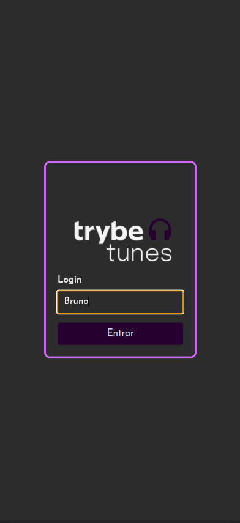
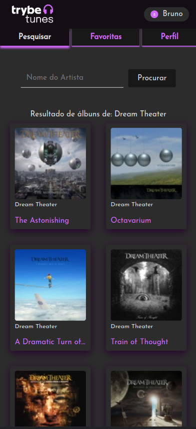
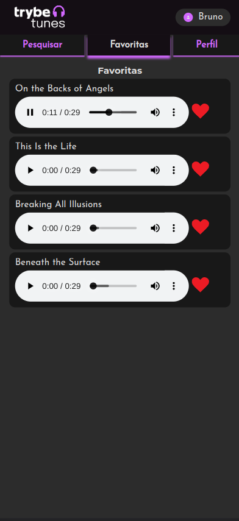
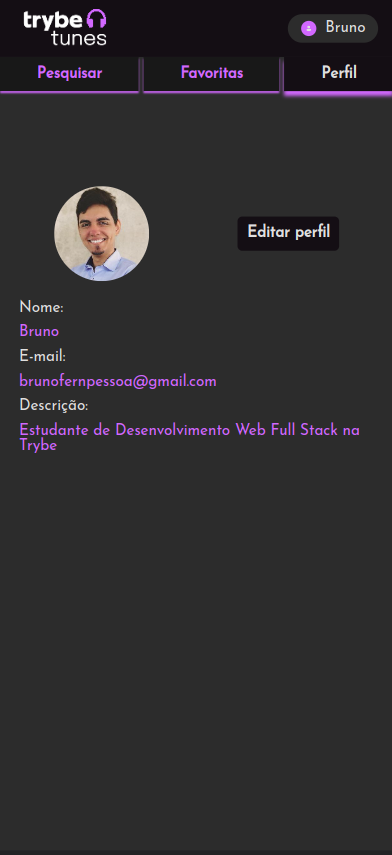

# Projeto TrybeTunes

## Contexto
Este projeto foi desenvolvido com o intuito de consolidar os estudos da biblioteca __React__ durante o curso de Desenvolvimento Web na Trybe.

Aqui o objetivo foi construir uma aplicação de preview de músicas com componentes __React__ de classe, com o foco principal deste projeto estando na utilização dos métodos que constituem o chamado __Ciclo de Vida de Componentes React__, como ```componentDidMount(), componentDidUpdate() e componentWillUnmount()```, sendo também uma ótima revisão para o estudo de __rotas__ e __estados dos componentes__.

Neste projeto nos foi fornecido pela Trybe algumas funções para agilizar o desenvolvimento , mais especificamente funções de requisição da API (diretório services), isso devido à uma necessidade avaliativa da Trybe de inserir um atraso nas requisições, que eu removi para melhorar a experiência do usuário que desejar executar a aplicação.

<details>
<summary>Veja Aplicação em funcionamento</summary>








</details>

### Técnologias usadas

> Desenvolvido com: React, CSS3, HTML5, ES6

### Executando aplicação
No diretório raiz do projeto execute o comando abaixo para instalar as dependências.
```bash
npm install
``` 
Para executar o projeto:
``` bash
npm start
```